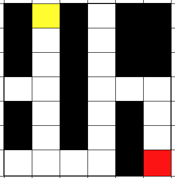
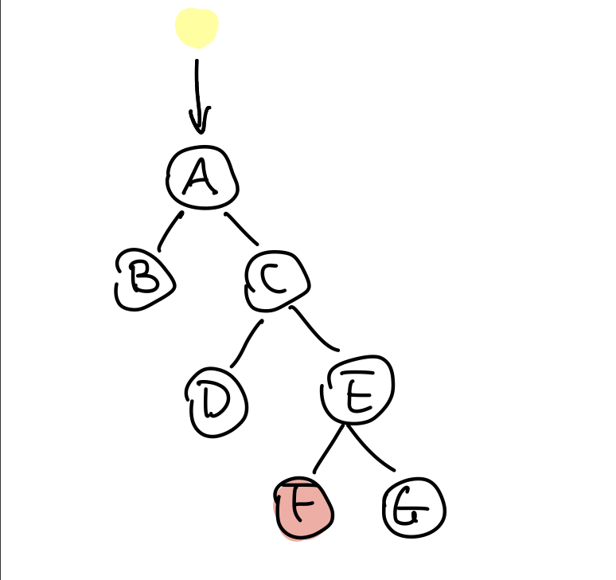
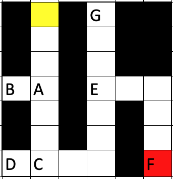

# Lee Algorithm Implementation
COMP 221 Algorithm Design and Analysis 

Rita Li and Sam Ding

In this project, we implemented the Lee algorithm. Lee algorithm is based on Breadth-first Search (BFS) and provides one possible solution for the common maze routing problem.

## Composition
The package Maze contains four classes: Cell, Node, Lee, and Maze.

### Cell
This class stores the x and y coordinates.

### Node
This class stores the Cell, which contains the x and y coordinates, and the status of each Cell.

### Lee
This class implements the Lee algorithm. 

### Maze
This class contains the main function that takes in a 20x20 matrix and computes the optimal/shortest path available from the start to the finish.

## How It Works
How does a BFS algorithm work in a maze? Let's start with a simple maze:

Assuming we want to get to the red block from the yellow block, we can simplify this maze into a tree like this:

Like the BFS algorithm, once we have converted the maze into a tree, the algorithm follows the route from the yellow block and visits every node (intersection) of the maze. Then, it will visit that node's children, the first child's children, and the second child's children etc. The Lee algorithm goes through all possible routes to find the route that leads to the desired goal (the red block). If, along the way, the algorithm reaches a dead end when visiting a child, it will return to its predecessor and start on an alternate route. 

