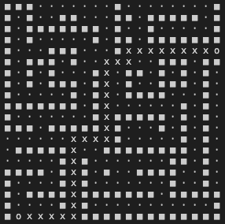
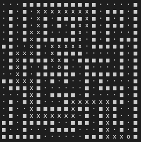

# Lee Algorithm Implementation
COMP 221 Algorithm Design and Analysis 

Rita Li and Sam Ding

In this project, we implemented the Lee algorithm. Lee algorithm is based on Breadth-first Search (BFS) and provides one possible solution for the common maze routing problem.

## Composition
The package Maze contains four classes: Cell, Node, Lee, and Maze.

### Cell
This class stores the x and y coordinates.

### Node
This class stores the Cell, which contains the x and y coordinates, and the status of each Cell.

### Lee
This class implements the Lee algorithm. 

### Maze
This class contains the main function that takes in a 20x20 matrix and computes the optimal/shortest path available from the start to the finish. Use this java file to run the program.

## Data Structure

In this algorithm, we used a 2d array to represent the maze. Each item in the array represent each block on the maze and we use numbers to represent its current status. In a raw maze like this:

```
        int[][] rawMaze = {
            {1,1,1,0,0,0,0,0,0,0,1,0,0,0,0,0,0,0,0,1},
            {1,0,1,0,0,1,1,0,0,0,1,1,0,1,1,1,1,1,0,1},
            {1,0,1,1,1,1,1,1,1,0,1,0,0,1,0,0,0,0,0,1},
            {1,0,1,0,0,0,0,0,1,0,1,1,0,1,1,1,1,1,1,1},
            {1,0,0,0,1,1,1,0,0,0,1,0,0,0,0,0,0,0,0,3},
            {1,0,1,1,1,0,1,0,0,0,0,0,0,0,1,1,1,0,1,1},
            {1,0,1,0,1,0,0,0,1,0,0,1,1,0,1,0,1,0,1,0},
            {1,0,1,0,1,1,1,0,1,0,0,1,0,0,1,1,1,0,1,0},
            {1,0,0,0,0,0,1,0,1,0,0,1,1,1,1,0,0,0,1,0},
            {1,1,1,1,1,1,1,0,1,0,0,0,0,0,0,0,1,0,1,0},
            {1,0,0,0,0,0,0,0,1,0,1,1,1,1,1,0,1,0,1,0},
            {1,1,1,0,1,1,1,1,1,0,1,0,0,0,1,0,1,0,1,0},
            {0,0,0,0,0,0,0,0,0,0,1,0,0,0,0,0,1,0,1,0},
            {0,1,1,1,1,1,0,0,0,1,1,1,1,1,1,1,1,0,1,0},
            {0,0,0,0,0,1,0,1,0,0,0,0,0,0,0,1,1,0,1,0},
            {1,1,1,1,0,1,0,1,0,1,0,0,1,1,1,1,0,0,1,0},
            {1,0,0,0,0,1,0,1,0,0,0,0,0,0,0,1,0,0,1,0},
            {1,0,1,1,1,1,0,1,1,1,1,1,1,1,0,1,1,1,1,1},
            {1,0,0,0,0,1,0,1,0,0,0,0,0,0,0,0,0,0,0,1},
            {1,2,0,0,0,0,0,1,1,1,1,1,1,1,1,1,1,1,1,1},
        };
```

we used `0` to represent available routes, `1` to represent walls, `2` to represent start point, and `3` to represent finish point.

Inside the BFS algorithm, we also used a HashMap to map all predecessors with their respective nodes and a queue to determine which node the algorithm to visit next. In a typical BFS algorithm, we would use a queue rather than a stack, because we utilize its first in first out (FIFO) characteristics to visit all child under one parent first, then visit those children's child and so on. 


## How It Works
How does a BFS algorithm work in a maze? Let's start with a simple maze:


Assuming we want to get to the red block from the yellow block, we can simplify this maze into a tree like this:


where the maze would be labelled as:


Like the BFS algorithm, once we have converted the maze into a tree, the algorithm follows the route from the yellow block and visits the first node of the maze (A). Then, it will visit that node's children (B & C), the first child's children (N/A), and the second child's children (C) etc. The Lee algorithm goes through all possible routes to find the route that leads to the desired goal (the red block, or F). The BFS algorithm (the method `BFS` under Lee.java) constructs a tree from the maze and then finds an optimal path using a backtracking algorithm (the method `findPath` under Lee.java). If, along the way, the algorithm reaches a dead end when visiting a child (like B, D, or G), it will return to its predecessor and start on an alternate route. If the maze does not have a path that connects the start point with the finishing point, the algorithm will return `NO PATH OUT!` and returns the original maze in a texual form, so that users can see why it doesn not lead to a way out.

## Implementation

Now that we know how the algorithm works, we can expand that onto a 20x20 maze to test its functionality. Say we have have a maze like this:


We were able to represent it in a pure textual form in the console by printing the array line by line using symbols. Here, after using the Lee algorithm, we printed the map below.



`■ = walls, · = route, x = shortest path, o = start/finish`


In another example, we were also able to run the algorithm on a maze that doesn't have a starting/finishing point in the middle. For example, having the maze start right in the center. It's gratifying to see the result (below):



`■ = walls, · = route, x = shortest path, o = start/finish`

The maze is still being read by the algorithm and displays the shortest route available.

## Limitations
Because of the time limits on this project, there were several aspects that we would like to improve in the future:

1) Out of all the maze-routing algorithms, Lee algorithm is probably one of the least efficient algorithms. There are other algorithms that does not involve searching all the available routes, including one that is called A* search algorithm, which is being widely used in computer science. Lee algorithm is the one that is closest to the BFS algorithm that we have studied.

2) At one point, our group was considering adding a graphic user interface (GUI) to allow users draw their own maze using their mouse, which will generate an array for the algorithm to solve. We were unable to achieve this during the time we have, because we were not able to use kilt graphics package on a repository that we created on our own. In Java's own awt package and other packages that includes the event listeners applicable to what we are doing, it takes significantly longer time for us to create shapes that constitute a maze.